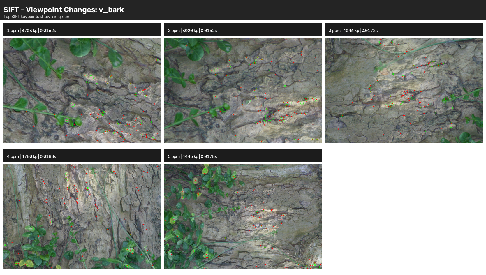
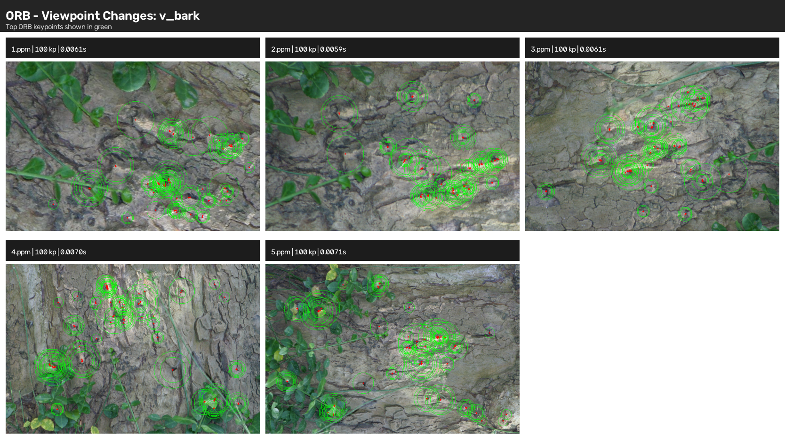
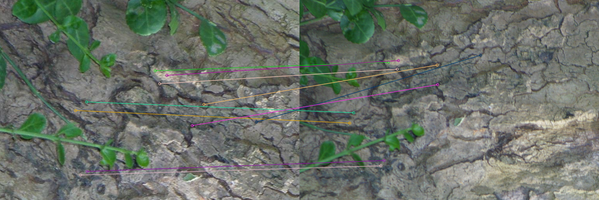
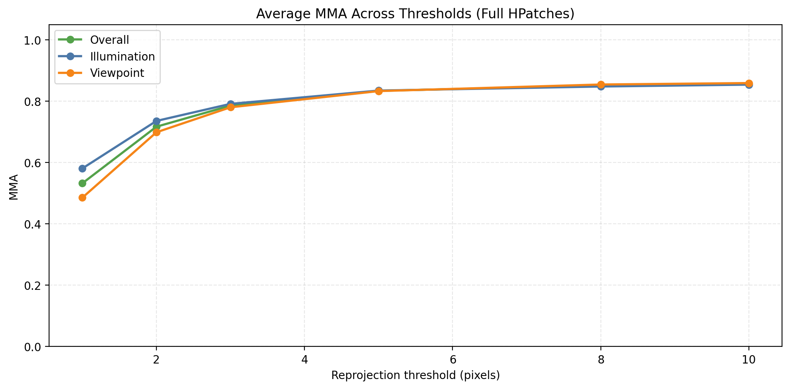
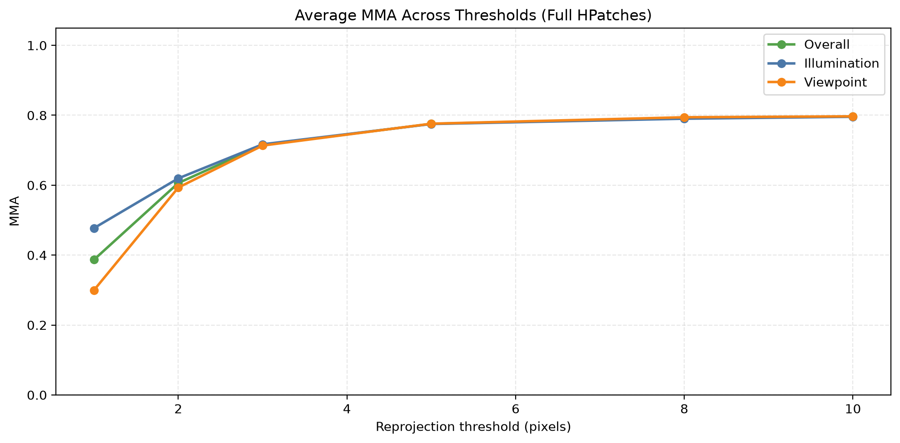
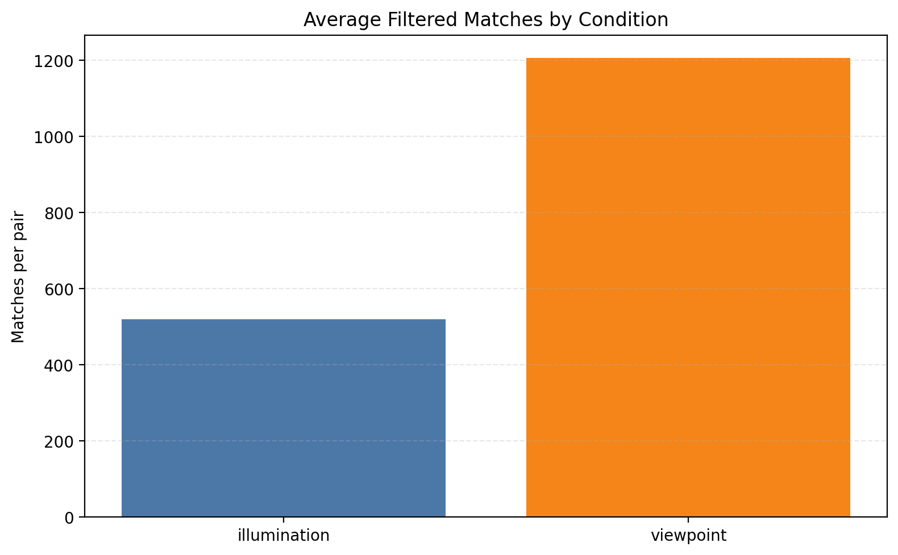
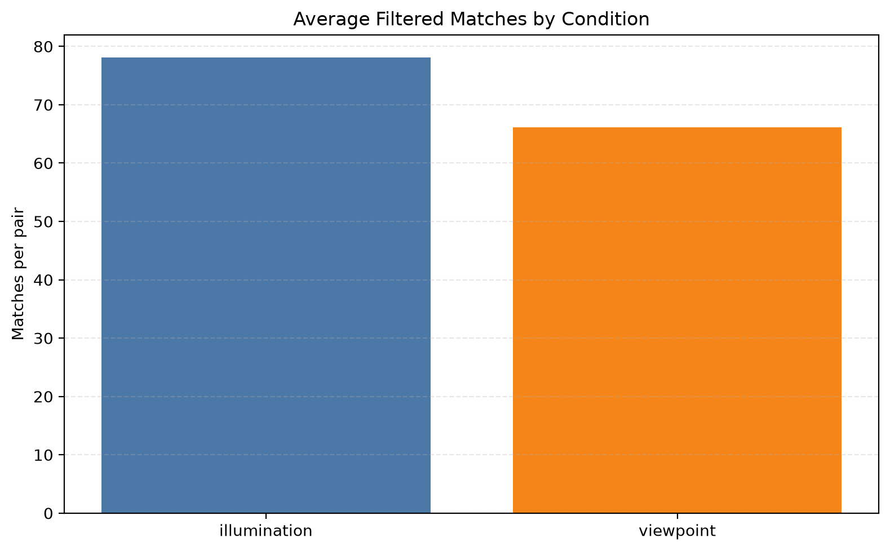
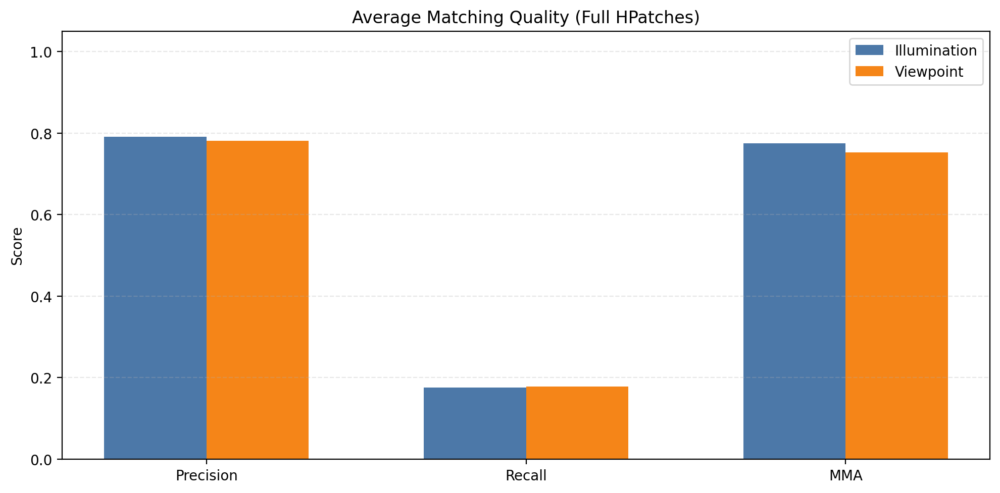
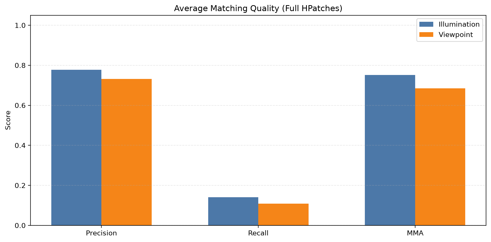

<p align="center">
  
</p>

# EECS 4422: Computer Vision | Summer 2026 Project Report

# A Comparative Study of SIFT and ORB for Wide-Baseline Feature Matching
  
## Authors / Group Members

- Abrar Jawad Tarafder
- Ekambir Momi
- Thor Laski
- Antonio Lamacchia
- Emily Zelkowicz

---

## Overview

Local feature matching is a core building block for image registration, panorama stitching, visual localization, Structure-from-Motion, SLAM, and 3D reconstruction. This project is a side-by-side evaluation of two classical local feature pipelines, **Scale-Invariant Feature Transform (SIFT)** and **Oriented FAST and Rotated BRIEF (ORB)**, on the **HPatches** benchmark. The goal is to measure how well each method detects, describes, matches, and geometrically verifies correspondences under viewpoint and illumination changes, while also tracking the computational cost of the full pipeline.

The repository includes the full OpenCV-based implementation for feature extraction, descriptor matching, homography-based geometric verification, and batch evaluation scripts that generate the figures and summary files used in the report. The same HPatches data, preprocessing, matching strategy, and scoring logic are reused across both methods so the comparison stays fair and reproducible.

## Project Goals

- Implement practical SIFT and ORB matching pipelines from scratch in Python.
- Evaluate both methods on HPatches sequences with illumination and viewpoint changes.
- Compare matching quality using precision, recall proxy, Mean Matching Accuracy (MMA), and reprojection error.
- Compare speed and resource cost alongside matching robustness.
- Produce visual outputs that make the results easy to inspect and present.

## Method Pipeline

1. Load a reference image and a target image from HPatches.
2. Convert the images to grayscale and detect keypoints / compute descriptors with SIFT or ORB.
3. Match descriptors with a brute-force matcher and Lowe's ratio test.
4. Keep only mutual-best correspondences.
5. Project reference keypoints with the ground-truth homography.
6. Score the matches using geometric consistency metrics.
7. Save visualizations, summary plots, and benchmark outputs.

## Dataset

- `hpatches-release`: patch-based HPatches data used by the extraction utilities.
- `hpatches-sequences-release`: full HPatches image sequences and homographies used for matching and verification.
- The loader expects both datasets under `data/` at the repository root, matching the paths in `project/data_loader.py`.
- HPatches contains 116 sequences in total: 59 viewpoint sequences and 57 illumination sequences.
- Each sequence provides one reference image (`1.ppm`) and five transformed images (`2.ppm` through `6.ppm`), together with ground-truth homographies for the transformed views.

## Evaluation Metrics

- Number of detected keypoints.
- Precision: correct matches divided by total accepted matches.
- Recall proxy: correct matches divided by visible reference keypoints.
- Mean Matching Accuracy (MMA): average accuracy across reprojection thresholds.
- Mean reprojection error: average pixel error after homography projection.
- Runtime: feature extraction or matching wall-clock time, depending on the script.

## Current Benchmark Snapshot

The generated full-benchmark summaries in this repository cover 580 reference/test pairs across 116 HPatches sequences. This comes directly from evaluating the reference image against the five transformed images in each sequence: `116 × 5 = 580` pairs.

- SIFT overall: precision `0.786`, recall `0.177`, MMA `0.763`.
- ORB overall: precision `0.754`, recall `0.124`, MMA `0.717`.
- Full sweep runtime in the generated summaries: SIFT about `200-300` seconds, ORB about `13-15` seconds.

These figures capture the main trade-off of the project: SIFT is stronger geometrically, while ORB is much faster.

## Repository Structure

The tree below reflects the main source, evaluation, and generated-output folders currently in the repository.

```text
.
├── figures/
│   └── readme_img.png
├── project/
│   ├── data_loader.py
│   ├── SIFT/
│   │   ├── feature_extraction.py
│   │   ├── feature_matching.py
│   │   ├── homography_verification.py
│   │   ├── extraction_samples/
│   │   ├── matching/
│   │   └── homography/
│   ├── ORB/
│   │   ├── feature_extraction.py
│   │   ├── feature_extraction_max.py
│   │   ├── feature_matching.py
│   │   ├── extraction_samples/
│   │   ├── extraction_samples_max/
│   │   └── matching/
│   ├── sift_evaluation/
│   │   ├── extraction_evaluation.py
│   │   ├── matching_evaluation.py
│   │   ├── full_matching_evaluation.py
│   │   ├── figures/
│   │   └── results/
│   └── orb_evaluation/
│       ├── matching_evaluation.py
│       ├── full_matching_evaluation.py
│       ├── figures/
│       └── results/
├── report/
│   └── test.txt
└── README.md
```

## Visual Comparison

These examples use the same sequence names and pair IDs so the SIFT and ORB outputs can be compared directly.

### Feature Extraction

<table>
  <tr>
    <td width="50%">
      
      <p align="center"><strong>SIFT</strong></p>
    </td>
    <td width="50%">
      
      <p align="center"><strong>ORB</strong></p>
    </td>
  </tr>
</table>

### Matching Example

<table>
  <tr>
    <td width="50%">
      
      <p align="center"><strong>SIFT</strong></p>
    </td>
    <td width="50%">
      
      <p align="center"><strong>ORB</strong></p>
    </td>
  </tr>
</table>

## Setup

1. Create and activate a Python virtual environment.
2. Install the runtime dependencies:

```bash
pip install numpy matplotlib opencv-contrib-python
```

3. Download the HPatches datasets and place them under:

```text
data/hpatches-release
data/hpatches-sequences-release
```

4. If your dataset lives elsewhere, update the paths in `project/data_loader.py`.

## Implementation Stack

- Python
- OpenCV
- NumPy
- Matplotlib

## How To Run

Run the scripts from the repository root.

### SIFT demos

- `python project/SIFT/feature_extraction.py`
- `python project/SIFT/feature_matching.py`
- `python project/SIFT/homography_verification.py`

### ORB demos

- `python project/ORB/feature_extraction.py`
- `python project/ORB/feature_matching.py`

### Focused evaluation scripts

- `python project/sift_evaluation/extraction_evaluation.py`
- `python project/sift_evaluation/matching_evaluation.py`
- `python project/sift_evaluation/full_matching_evaluation.py`
- `python project/orb_evaluation/matching_evaluation.py`
- `python project/orb_evaluation/full_matching_evaluation.py`

Each script exposes additional CLI flags such as `--lighting-sequence`, `--viewpoint-sequence`, `--reference-image`, `--test-image`, `--ratio`, `--top-k`, and `--output-dir`. Use `--help` to see the full list.

## Generated Outputs

The repository already includes representative figures and summaries produced by the scripts above.

- `project/SIFT/extraction_samples/` and `project/ORB/extraction_samples/`: keypoint visualizations for viewpoint and illumination sequences.
- `project/SIFT/matching/` and `project/ORB/matching/`: example match visualizations for selected pairs.
- `project/SIFT/homography/`: verification plots, including reprojection errors and MMA curves.
- `project/*_evaluation/figures/`: aggregated plots for the focused and full-benchmark evaluations.
- `project/*_evaluation/results/`: CSV and JSON summaries from the full HPatches sweeps.

## Report Structure

```text
1. Introduction

2. Dataset
    2.1 HPatches Benchmark
    2.2 Image Preparation
    2.3 Data Loader

3. Methodology
    3.1 Overall Pipeline
    3.2 Feature Extraction
        3.2.1 SIFT
        3.2.2 ORB
    3.3 Feature Matching
        3.3.1 SIFT Matching
        3.3.2 ORB Matching
        3.3.3 Best Correspondence Selection
    3.4 Homography-Based Geometric Verification
        3.4.1 Results
        3.4.2 Interpretation

4. Results, Evaluation and Discussion
    4.1 Feature Detection Comparison
        4.1.1 Number of Detected Keypoints in SIFT
        4.1.2 Number of Detected Keypoints in ORB
    4.2 Feature Matching Comparison
        4.2.1 Precision for SIFT
        4.2.2 Precision for ORB
        4.2.3 Recall for SIFT
        4.2.4 Recall for ORB
        4.2.5 Mean Matching Accuracy (MMA) for SIFT
        4.2.6 Mean Matching Accuracy (MMA) for ORB
    4.3 Robustness Results
        4.3.1 Reprojection Error for SIFT
        4.3.2 Reprojection Error for ORB
        4.3.3 Viewpoint Changes for SIFT
        4.3.4 Viewpoint Changes for ORB
        4.3.5 Illumination Changes for SIFT
        4.3.6 Illumination Changes for ORB
    4.4 Performance Analysis
        4.4.1 Runtime Comparison of SIFT vs. ORB
    4.5 Discussion about SIFT vs. ORB

5. References
```

## Results Summary

These plots give a quick visual read on the full-benchmark behavior of the two pipelines. SIFT is generally stronger geometrically, while ORB stays lighter and faster to compute.

### Mean Matching Accuracy

<table>
  <tr>
    <td width="50%">
      
      <p align="center"><strong>SIFT</strong></p>
    </td>
    <td width="50%">
      
      <p align="center"><strong>ORB</strong></p>
    </td>
  </tr>
</table>

### Average Match Counts

<table>
  <tr>
    <td width="50%">
      
      <p align="center"><strong>SIFT</strong></p>
    </td>
    <td width="50%">
      
      <p align="center"><strong>ORB</strong></p>
    </td>
  </tr>
</table>

### Average Match Quality

<table>
  <tr>
    <td width="50%">
      
      <p align="center"><strong>SIFT</strong></p>
    </td>
    <td width="50%">
      
      <p align="center"><strong>ORB</strong></p>
    </td>
  </tr>
</table>

---

## License

This repository was developed as part of the **EECS 4422: Computer Vision** course at **York University** during **Summer 2026**. It is intended for educational and academic purposes.
